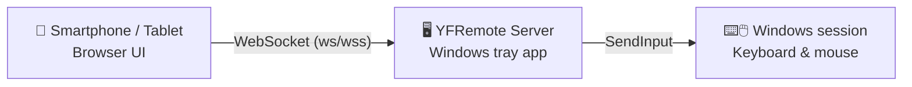

<p align="center">
  
</p>

<h1 align="center">YFRemote</h1>

<p align="center">
  Turn a smartphone, tablet, or second computer into a keyboard-and-mouse remote control for a Windows PC.
</p>

<p align="center">
  <a href="https://github.com/YannikFroehlich/YFRemote.Server/releases/latest"></a>
  <a href="https://github.com/YannikFroehlich/YFRemote.Server/actions/workflows/ci.yml"></a>
  <a href="https://github.com/YannikFroehlich/YFRemote.Server/releases"></a>
  
</p>

YFRemote turns a smartphone, tablet, or second computer into a remote control for
a Windows PC. It runs quietly in the taskbar's notification area and serves its
control UI over the local network through a browser — no app install required on
the controlling device.



## Features

- **Touchpad & keyboard** — mouse movement, clicks, and scrolling plus key presses
  and hotkeys via touch, low-latency over WebSocket.
- **Custom buttons & macros** — place your own buttons with key/hotkey actions
  freely on a grid; multi-step macros wait for the server's acknowledgement of
  each individual step.
- **Layout profiles** — create and switch between multiple named button layouts,
  and export/import them as JSON to reuse on another device.
- **Secure pairing** — connections require a PIN or a scanned QR code first;
  paired devices can be viewed and revoked at any time from the tray menu.
- **Optional HTTPS** — a self-issued local certificate authority, installable
  on a phone via a tray QR code, for a browser-warning-free connection.
- **Tray integration** — device address, PIN, paired devices, and updates, all
  from the notification area, with no separate window.
- **Automatic updates** — background update checks and one-click installation via
  Velopack, sourced from this repository's public GitHub Releases.
- **Traceable diagnostics** — rotating log files that never contain PINs, tokens,
  or typed text, reachable directly from the tray menu.
- **Controller mode (Windows)** — turns the phone into a virtual Xbox 360
  controller for games; every connected device becomes its own player (up to 4).
  Presets for Xbox, PlayStation, Nintendo Switch and Retro (SNES) labels and
  layouts; every button and stick can be moved, resized or hidden.
  Needs the free [ViGEmBus](https://github.com/nefarius/ViGEmBus/releases/latest)
  driver once; the tray menu links to it while it is missing.
- **Linux support (beta)** — a `uinput`-based input backend, verified end-to-end
  on x86_64; arm64 and the installed package are not yet verified
  (details in [`AGENTS.md`](AGENTS.md)).

## Getting started

In-depth guides live in the [wiki](https://github.com/YannikFroehlich/YFRemote.Server/wiki) (German):

- [Installation](https://github.com/YannikFroehlich/YFRemote.Server/wiki/Installation) — requirements, download, install steps, uninstalling
- [Usage](https://github.com/YannikFroehlich/YFRemote.Server/wiki/Verwendung) — operation, connecting, updates
- [Troubleshooting](https://github.com/YannikFroehlich/YFRemote.Server/wiki/Fehlerbehebung) — solutions for common problems

All ready-to-run downloads (installer, portable build, MSI) are on the
[latest GitHub Release](https://github.com/YannikFroehlich/YFRemote.Server/releases/latest).
Short version: download and run the installer, then enter the PIN from the tray
menu on the controlling device — done. See [`CHANGELOG.md`](CHANGELOG.md) for what
changed in each version.

## Security

A device must pair once via a PIN before it can send control commands. The
current PIN is shown in YFRemote's tray menu (also available to copy, and
replaceable via "regenerate PIN"). A QR dialog opens the device address on the
mobile device and can optionally pre-fill the PIN in the URL fragment, without
transmitting it to the HTTP server. A new PIN is generated automatically after a
successful pairing. A device only receives a permanent token once its pairing
has been safely persisted; paired devices can be viewed and individually removed
from the tray menu. In the client, the current device can also revoke its own
token server-side via "Unpair this device" in settings.

HTTPS is optional (port 5443) and switched on with "Use HTTPS" in the tray
menu, which stores the choice in `%LOCALAPPDATA%\YFRemote\settings.json` and
restarts YFRemote; `Https:Enabled` in `appsettings.json` still works for
unattended setups. The server issues its own local certificate authority once
and signs a certificate for every local IPv4 address. "Install certificate..."
in the tray menu shows a QR code and instructions to trust it on Android or
iOS. Installing it is optional: without it the connection is still encrypted,
the browser just shows a warning you have to click through, and the service
worker stays unregistered. Note that on Android the QR code only downloads the
file — installing it is a separate step in the system settings. HTTP keeps
serving unchanged either way; enabling HTTPS changes the page origin, so paired
devices need to pair again.

Without HTTPS the browser refuses the microphone, the camera, and clipboard
access on a page served over a plain-HTTP LAN address — that is a browser rule
for insecure origins, not a setting, so dictation in the touchpad's text field
needs HTTPS (or the phone keyboard's own dictation, which is plain typing).
Likewise, text fetched from the PC's clipboard can only be copied with one tap
over HTTPS; over plain HTTP it is shown for you to select and copy manually.

Still, only use YFRemote on a trusted private network, and don't forward port
`5050` (or `5443` with HTTPS enabled) to the internet on your router. See
[Security](https://github.com/YannikFroehlich/YFRemote.Server/wiki/Sicherheit) in
the wiki for details.

## Diagnostics

YFRemote writes rotating runtime logs to `%LOCALAPPDATA%\YFRemote\Logs`. "Open
diagnostics folder" in the tray menu opens it directly. Logs rotate daily and at
10 MB; the newest 14 files are kept. PINs, tokens, and typed text are never
logged.

## Layout profiles

Custom buttons, macros, and their arrangement can be saved into named profiles
and switched between directly. Settings lets you export all profiles as a JSON
file and import them again on another device. An existing single layout is
automatically adopted as the "Default" profile on first launch.

## For developers

YFRemote lives entirely in this repository:

| Area | Location | Technology |
| --- | --- | --- |
| Server, tray app, installer, releases | Repository root | .NET (`net10.0-windows` / `net10.0`) |
| Control UI | [`client/`](client) | Angular 21, zoneless, signals |

Start the server:

```powershell
dotnet restore
dotnet test tests\YFRemote.Server.Tests\YFRemote.Server.Tests.csproj --configuration Release
dotnet run
```

Build the client and wire it into the server:

```powershell
cd client
npm ci
npm run build
cd ..
New-Item -ItemType Directory -Path wwwroot -Force | Out-Null
Copy-Item client\dist\YFRemote.Client\browser\* wwwroot -Recurse -Force
```

Details on the development environment, client integration, and endpoints live
in the wiki under
[Development](https://github.com/YannikFroehlich/YFRemote.Server/wiki/Entwicklung).
For the release process, see
[Release process](https://github.com/YannikFroehlich/YFRemote.Server/wiki/Release-Prozess)
in the wiki, as well as [`AGENTS.md`](AGENTS.md).
