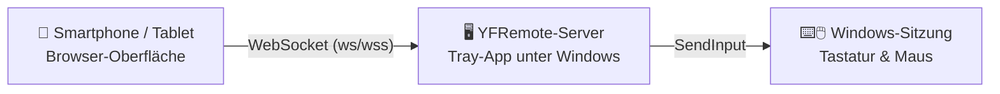

<p align="center">
  
</p>

<h1 align="center">YFRemote</h1>

<p align="center">
  Smartphone, Tablet oder Zweit-PC als Fernbedienung für Tastatur und Maus eines Windows-Rechners.
</p>

<p align="center">
  <a href="https://github.com/YannikFroehlich/YFRemote.Server/releases/latest"></a>
  <a href="https://github.com/YannikFroehlich/YFRemote.Server/actions/workflows/ci.yml"></a>
  <a href="https://github.com/YannikFroehlich/YFRemote.Server/releases"></a>
  
</p>

YFRemote verwandelt ein Smartphone, Tablet oder einen zweiten Computer in eine
Fernbedienung für einen Windows-PC. Die Anwendung läuft unauffällig im Infobereich
der Taskleiste und stellt die Bedienoberfläche im lokalen Netzwerk über den Browser
bereit — keine App-Installation auf dem Steuergerät nötig.



## Funktionen

- **Touchpad & Tastatur** — Mausbewegung, Klicks, Scrollen sowie Tastendrücke und
  Hotkeys per Touch, latenzarm über WebSocket.
- **Individuelle Buttons & Makros** — eigene Schaltflächen mit Tasten-/Hotkey-Aktionen frei
  auf einem Raster platzieren; Mehrschritt-Makros warten auf die Server-Bestätigung
  jedes einzelnen Schritts.
- **Layoutprofile** — mehrere benannte Button-Layouts anlegen, wechseln und als JSON
  exportieren/importieren, um sie auf einem anderen Gerät wiederzuverwenden.
- **Sichere Kopplung** — Verbindung nur nach PIN-Eingabe oder Scan eines QR-Codes;
  gekoppelte Geräte lassen sich jederzeit im Tray-Menü einsehen und widerrufen.
- **Tray-Integration** — Geräteadresse, PIN, gekoppelte Geräte und Updates direkt aus
  dem Infobereich der Taskleiste, ohne separates Fenster.
- **Automatische Updates** — Update-Prüfung im Hintergrund und Ein-Klick-Installation
  über Velopack, Bezug aus den öffentlichen GitHub Releases dieses Repositories.
- **Nachvollziehbare Diagnose** — rotierende Logdateien ohne PINs, Tokens oder
  eingegebene Texte, direkt über das Tray-Menü erreichbar.
- **Linux-Unterstützung (Beta)** — ein `uinput`-basierter Eingabe-Backend-Zweig existiert
  und ist unit-getestet, wurde aber noch nicht gegen einen echten Linux-Kernel verifiziert
  (Details in [`AGENTS.md`](AGENTS.md)).

## Erste Schritte

Ausführliche Anleitungen stehen im [Wiki](https://github.com/YannikFroehlich/YFRemote.Server/wiki):

- [Installation](https://github.com/YannikFroehlich/YFRemote.Server/wiki/Installation) — Voraussetzungen, Download, Installationsschritte, Deinstallieren
- [Verwendung](https://github.com/YannikFroehlich/YFRemote.Server/wiki/Verwendung) — Bedienung, Verbindung herstellen, Updates
- [Fehlerbehebung](https://github.com/YannikFroehlich/YFRemote.Server/wiki/Fehlerbehebung) — Lösungen für häufige Probleme

Alle fertigen Downloads (Installer, portable Version, MSI) befinden sich im
[aktuellen GitHub Release](https://github.com/YannikFroehlich/YFRemote.Server/releases/latest).
Kurzfassung: Installer herunterladen und ausführen, PIN aus dem Tray-Menü auf dem
Steuergerät eingeben — fertig.

## Sicherheit

Ein Gerät muss sich einmalig über eine PIN koppeln, bevor es Steuerbefehle senden
kann. Die aktuelle PIN wird im Tray-Menü von YFRemote angezeigt (dort auch als
Kopie verfügbar und über "PIN neu erzeugen" austauschbar). Ein QR-Dialog öffnet die
Geräteadresse auf dem Mobilgerät und kann die PIN auf Wunsch im URL-Fragment
vorausfüllen, ohne sie an den HTTP-Server zu übertragen. Nach einer erfolgreichen
Kopplung wird automatisch eine neue PIN erzeugt. Das Gerät erhält erst dann ein
dauerhaftes Token, wenn seine Kopplung sicher gespeichert wurde; im Tray-Menü
lassen sich gekoppelte Geräte einsehen und einzeln wieder entfernen. Im Client kann
das aktuelle Gerät unter Einstellungen mit „Dieses Gerät entkoppeln“ sein Token
zusätzlich selbst serverseitig widerrufen.
Verwende YFRemote trotzdem nur in einem vertrauenswürdigen privaten Netzwerk und gib
Port `5050` im Router nicht für das Internet frei. Details siehe
[Sicherheit](https://github.com/YannikFroehlich/YFRemote.Server/wiki/Sicherheit) im Wiki.

## Diagnose

YFRemote schreibt rotierende Laufzeitprotokolle nach
`%LOCALAPPDATA%\YFRemote\Logs`. Über "Diagnoseordner öffnen" im Tray-Menü lässt sich
der Ordner direkt öffnen. Die Protokolle rotieren täglich sowie bei 10 MB Größe; die
neuesten 14 Dateien bleiben erhalten. PINs, Tokens und eingegebene Texte werden nicht
protokolliert.

## Layoutprofile

Eigene Buttons, Makros und deren Anordnung lassen sich in benannten Profilen speichern
und direkt wechseln. Unter Einstellungen können alle Profile als JSON-Datei exportiert
und auf einem anderen Gerät wieder importiert werden. Ein vorhandenes Einzel-Layout
wird beim ersten Start automatisch als Profil „Standard“ übernommen.

## Für Entwickler

YFRemote liegt vollständig in diesem Repository:

| Bereich | Ort | Technologie |
| --- | --- | --- |
| Server, Tray-App, Installer, Releases | Repository-Wurzel | .NET (`net10.0-windows` / `net10.0`) |
| Bedienoberfläche | [`client/`](client) | Angular 21, zoneless, Signals |

Server starten:

```powershell
dotnet restore
dotnet test tests\YFRemote.Server.Tests\YFRemote.Server.Tests.csproj --configuration Release
dotnet run
```

Client bauen und in den Server einbinden:

```powershell
cd client
npm ci
npm run build
cd ..
New-Item -ItemType Directory -Path wwwroot -Force | Out-Null
Copy-Item client\dist\YFRemote.Client\browser\* wwwroot -Recurse -Force
```

Details zu Entwicklungsumgebung, Client-Integration und Endpunkten stehen im Wiki
unter [Entwicklung](https://github.com/YannikFroehlich/YFRemote.Server/wiki/Entwicklung).
Zum Release-Prozess siehe [Release-Prozess](https://github.com/YannikFroehlich/YFRemote.Server/wiki/Release-Prozess)
im Wiki sowie [`AGENTS.md`](AGENTS.md).
